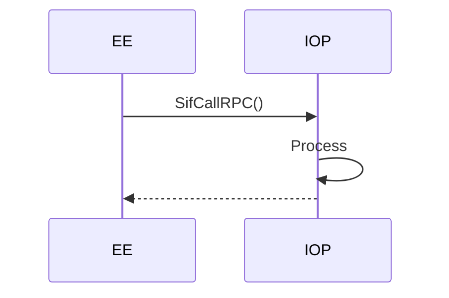

lwNBD-sifrpc-server(1) -- Playstation 2 SIF server
=============================================

TARGETS : PlayStation 2

STATUS : experimental

# The Library Hierarchy 

The libraries that use the SIF to transfer data are arranged in a hierarchy : 

* RPC
* CMD
* DMA
* [DMAC]

# TODO 

* asyncronous using sceSifCheckStatRpc() SifGetNextRequest / SifExecRequest

# see also

* [TIF](https://www.psx-place.com/threads/retail-debugging-startup-card.14027/)